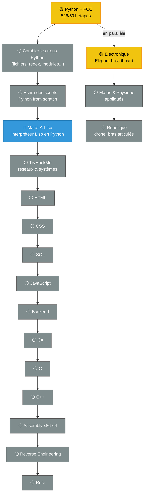

  <h1>⚡ Ingénieur Fou</h1>
  
<b>Autodidacte | En marche vers le Red Team ou la Robotique 🤖</b>

 

Je suis passionné par les systèmes numériques et j'apprends tout en autodidacte. Jusqu'à présent, je n'avais pas vraiment eu le temps d'approfondir sérieusement des sujets comme la cybersécurité ou le matériel.

Aujourd'hui, je prends le temps de structurer mon apprentissage pour acquérir des bases solides, brique par brique, plutôt que de sauter les étapes. Mon objectif final est de me diriger vers l'une de ces deux voies :

- 🛡️ **La cybersécurité offensive (Red Team)** — comprendre les systèmes assez profondément pour les attaquer et les défendre
- 🤖 **La robotique** — construire mes propres machines, du circuit électronique au code qui les fait bouger

---

### 📍 Où j'en suis

- **Python (FCC)** : 526 des 531 étapes terminées — reste Dynamic Programming, la révision et l'examen
- **Make-A-Lisp** : interpréteur Lisp écrit de zéro en Python, actuellement sur l'étape 4 (`fn*`, closures)
- **Électronique** : kit Elegoo Mega, montages sur breadboard, en parallèle

---

### 🗺️ Feuille de route complète

Chaque langage est poussé jusqu'à un niveau solide, avec révision complète, avant de passer au suivant — pas d'avancée précipitée.

---

### 🌱 Ma Philosophie

> *Prendre le temps de bien faire les choses. Mieux vaut des bases solides qu'un apprentissage précipité !*
