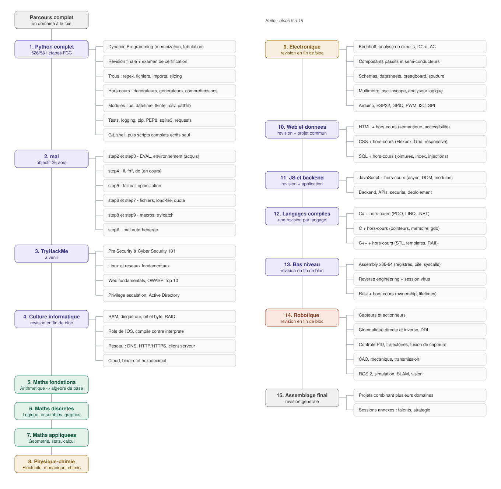

# ⚡ Ingénieur Fou

### Autodidacte | En marche vers le Red Team ou la Robotique 🤖

  

## 📑 Sommaire

 

**Présentation**
- [Qui je suis](#-qui-je-suis)
- [Mes objectifs](#-mes-objectifs)

 

**Parcours**
- [Où j'en suis](#-où-jen-suis)
- [Feuille de route complète](#️-feuille-de-route-complète)
- [Ma méthode de travail](#-ma-méthode-de-travail)

 

**Technique**
- [Stack technique](#️-stack-technique)
- [Statistiques GitHub](#-statistiques-github)

 

- [Ma philosophie](#-ma-philosophie)

 

---

 

## 🪪 Présentation

 

### 👋 Qui je suis

 

Je suis passionné par les systèmes numériques et j'apprends tout en autodidacte. Jusqu'à présent, je n'avais pas vraiment eu le temps d'approfondir sérieusement des sujets comme la cybersécurité ou le matériel — entre le lycée et le reste, ça restait en projet.

 

Aujourd'hui, j'ai décidé de prendre les choses en main et de structurer sérieusement mon apprentissage. Pas question de brûler les étapes ou de survoler les bases pour aller vite : je préfère avancer plus lentement mais construire quelque chose de solide, quitte à revenir en arrière sur un point mal compris plutôt que de faire semblant de l'avoir acquis.

 

Ce compte fonctionne comme une fenêtre ouverte sur mon parcours : je le mets à jour au fil de l'eau, ce n'est pas une présentation figée mais un reflet en continu de où j'en suis, où je vais, et comment j'apprends.

  

### 🎯 Mes objectifs

 

Je vise l'une de ces deux voies, et je garde les deux ouvertes le plus longtemps possible avant de trancher :

 

- 🛡️ **Cybersécurité offensive (Red Team)** — comprendre les systèmes assez profondément pour savoir les attaquer, donc aussi savoir les défendre. Ça passe par la maîtrise du bas niveau (C, Assembly), du réseau, et par la pratique sur des plateformes comme TryHackMe.

- 🤖 **Robotique** — construire mes propres machines de bout en bout : le circuit électronique, l'électronique de puissance, et le code qui pilote tout ça. J'ai un kit Elegoo comme point de départ, l'objectif est d'aller vers des projets bien plus ambitieux.

 

Les deux voies partagent un tronc commun (programmation, bas niveau, maths/physique), donc je n'ai pas besoin de choisir tout de suite — je construis les fondations qui serviront dans les deux cas.

  

---

 

### 📍 Où j'en suis

 

#### 🐍 Python — 526 / 531 étapes FCC

Python est mon premier langage, et je le pousse volontairement à fond avant de passer à la suite plutôt que de le considérer "acquis" trop vite. Je suis actuellement sur la certification Python de freeCodeCamp, où j'ai déjà validé :

- **Structures de données** : Big O, tableaux statiques/dynamiques, Stack (LIFO), Queue (FIFO), Singly & Doubly Linked Lists, Hash Tables (implémentées à la main, gestion des collisions)

- **Algorithmes** : linear & binary search, merge sort, quicksort, selection sort, bisection method, algorithme de Luhn, Tower of Hanoi (récursif)

- **Graphes & arbres** : BFS, DFS (récursif), N-Queens, adjacency list / adjacency matrix

- **Programmation orientée objet** : classes, encapsulation, héritage, polymorphisme, abstraction

Il ne reste que la **Dynamic Programming** (memoization, tabulation), la révision finale, puis l'examen de certification. Une fois ça bouclé, je comble les trous que le cours ne couvre pas (fichiers, regex, modules, décorateurs...) avant d'écrire des scripts complets seul, sans modèle.

  

#### 🧩 Make-A-Lisp — step4 en cours

Pour valider mes bases Python une bonne fois pour toutes, je me suis lancé dans **[Make-A-Lisp (mal)](https://github.com/kanaka/mal)** : écrire, seul et de zéro, un interpréteur Lisp complet en Python, en 11 étapes progressives — du simple READ/EVAL/PRINT jusqu'à un interpréteur capable de s'auto-héberger (faire tourner sa propre implémentation écrite en mal).

 

Chaque étape est écrite entièrement par moi-même — pas de squelette de code, pas de solution copiée. Là où je suis :

- ✅ step0 à step3 : REPL, lecture/écriture, évaluation des opérateurs, environnements (`let*`, `def!`, portée locale/globale, shadowing)

- 🔵 step4 en cours : `if`, `fn*` (fonctions utilisateur / closures), `do`

- ⬜ step5 à stepA : tail call optimization, fichiers, quoting, macros, gestion d'erreurs, auto-hébergement

 

Objectif : un parcours mal présentable d'ici fin août.

  

#### ⚡ Électronique — en parallèle

Pendant que j'avance sur l'informatique, j'apprends aussi l'électronique en parallèle avec un kit **Elegoo Mega** : montages sur breadboard, lecture de schémas, mesures au multimètre. L'objectif à terme : coder mes propres montages (au-delà de la simple LED) pour aller vers des projets robotiques autonomes.

  

### 🗺️ Feuille de route complète

 

Toute la suite du parcours est planifiée à l'avance, domaine par domaine — je ne saute pas d'un sujet à l'autre, je termine un bloc entier (avec révision) avant de passer au suivant.

 

 

*Le détail complet des blocs maths et physique-chimie (contenu précis, niveau de départ) est disponible [dans ce fichier séparé](./planning-detaille.svg).*

  

### 🧠 Ma méthode de travail

 

Quelques principes que je m'impose, tirés de l'expérience :

 

- **Un domaine à la fois.** Pas d'alternance entre Python, maths et électronique dans la même semaine — je termine un bloc complet avant de changer de sujet, révision comprise.

- **Comprendre avant de coder.** Je préfère saisir le "pourquoi" d'un algorithme ou d'une formule avant de l'implémenter, plutôt que de le faire tourner sans le comprendre.

- **Pas de raccourcis.** Un exercice résolu avec de l'aide extérieure sans être compris ne compte pas comme acquis — je préfère être bloqué plus longtemps mais m'en sortir réellement seul.

- **Révision systématique.** Chaque gros bloc terminé est suivi d'une révision complète avant de passer au suivant, pour que ça reste acquis sur la durée.

- **Un langage avant le suivant.** Je pousse chaque langage jusqu'à un niveau solide, pas juste "je l'ai survolé", avant de passer au suivant de la liste.

  

---

 

## 💻 Technique

 

### 🛠️ Stack technique

 

  

### 📊 Statistiques GitHub

 

  

---

 

## 🌱 Ma philosophie

 

> *Prendre le temps de bien faire les choses. Mieux vaut des bases solides qu'un apprentissage précipité !*
